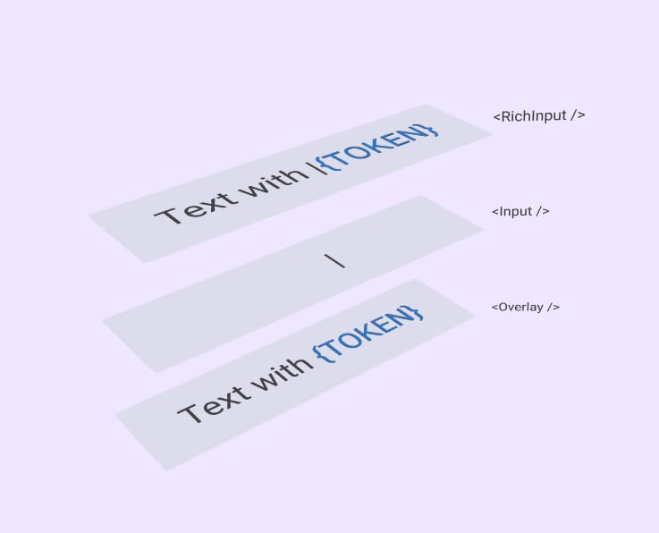

# Use React Rich Input

This package contains hooks and building blocks for rich input component.

## Usage example

See [minimal rich input implementation](./public/usage-example.tsx)

## Development

### Run dev server
```
pnpm dev
```

### Build package
```
pnpm build
```

## Implementation

This component is implemented without `contenteditable` attribute.
Current implementation uses overlay component to display `input` contents.



This approach was presented in this article: 
- https://akashhamirwasia.com/blog/building-highlighted-input-field-in-react/